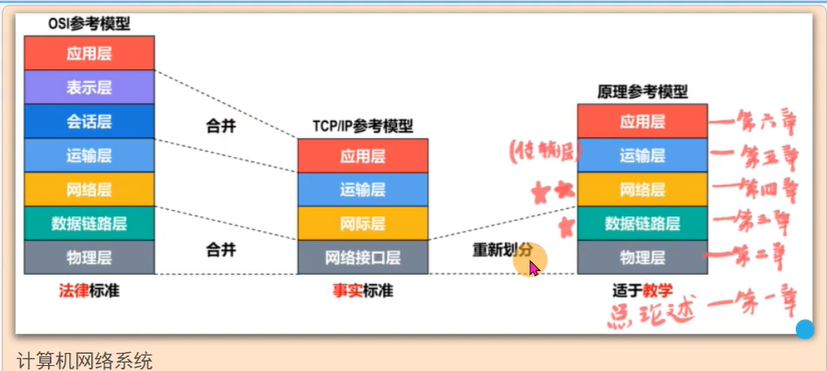
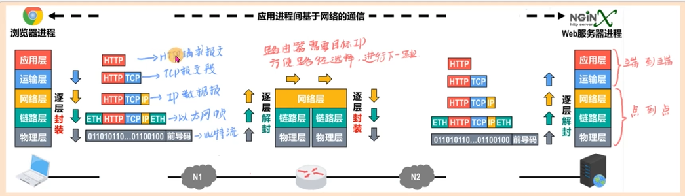
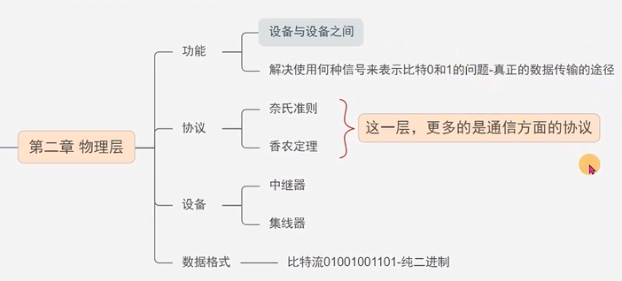
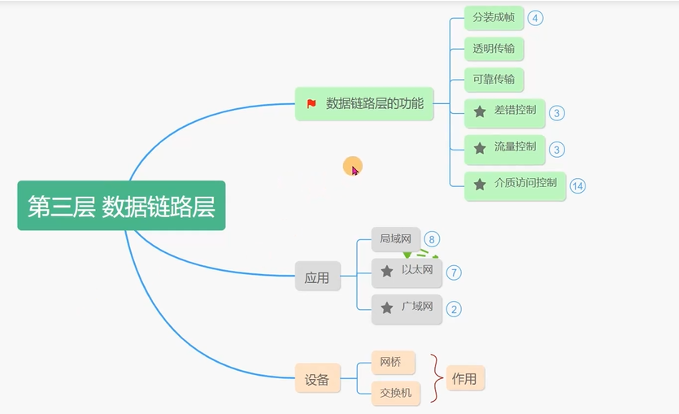
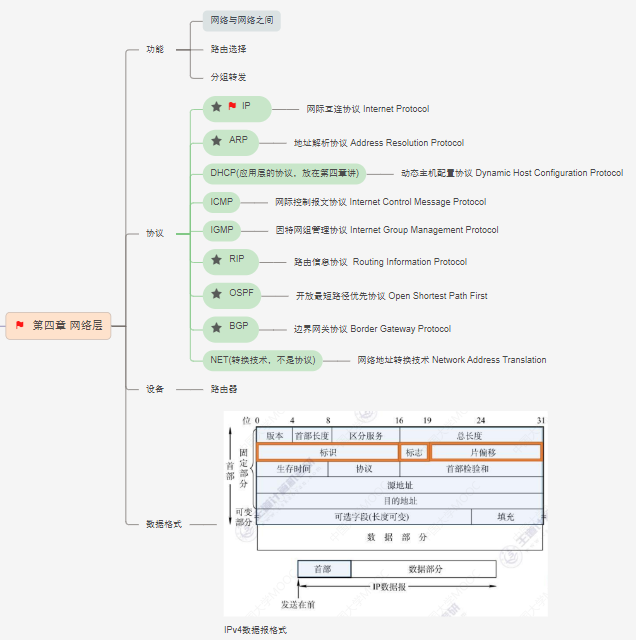
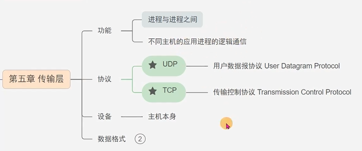
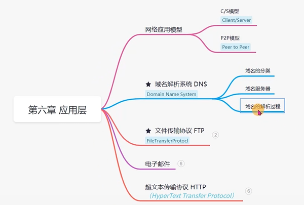

# 浏览器解析过程

1. 用户输入url并回车；
2. 进行DNS解析获得IP： 先搜索浏览器自身dns缓存； 再找本机dns缓存；如找到且未过期则搜索停止，如未找到，则向本地配置的首选dns服务器发起域名解析请求，后续由运营商的dns服务器查到或进一步发送请求，直到拿到域名对应的ip并返回给浏览器；
3. 发起TCP协议的三次握手：
   + 第一次握手：建立连接时，客户端发送syn(建立联机)包到服务器，并进入syn_send状态，等待服务器确认；
   + 第二次握手：服务器收到syn包，确认包信息，同时自己也发送一个syn + ack(确认)包并进入syn_recv状态;
   + 第三次握手：客户端收到syn+ack包，向服务器发送ack包，发送完后，客户端和服务器都进入established状态，完成三次握手；
4. 建立tcp连接后发起http请求；
5. 服务器收到http请求并响应，浏览器收到http代码；
6. 浏览器进行HTML文档解析并构建DOM树；
7. 遇到css样式如link或style标签则开始解析css并构建样式树；（HTML解析和css解析相互独立）
8. 遇到script标签则停止DOM解析并开始下载js并解析js，异步下载js的情况下，执行js仍会阻塞；
9. 解析完dom树和样式树后进行渲染树（render tree）的构建；
10. 渲染树构建后进行布局（Layout）
11. 遍历渲染树，绘制页面。

# 计算机网络体系结构
## 参考模型

## 数据传输格式

# 物理层

# 数据链路层

# 网络层

# 传输层

# 应用层

